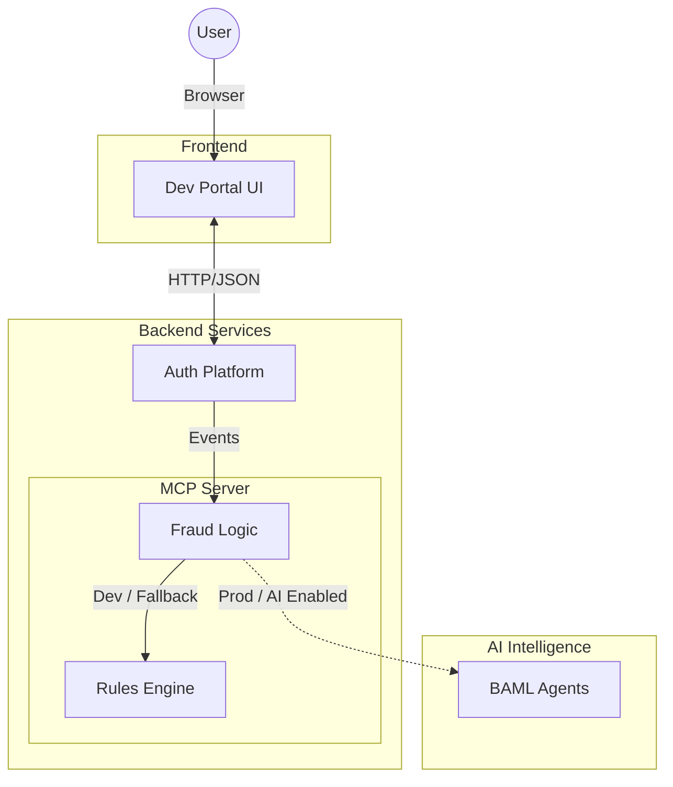

# Authentication Service

> [!NOTE]
> This service has not been deployed yet. It is currently configured for local development and testing.

This repository contains a full-stack authentication and fraud detection system composed of several microservices coordinated via Docker Compose.

## Services Layout

- `auth_platform/` — FastAPI authentication service (JWT, user register/login, 2FA).
- `dev-portal-ui/` — React-based developer portal UI that integrates with the auth API.
- `mcp_server/` — Model Context Protocol (MCP) server for enhanced fraud detection and AI-powered analysis.
- `agents/` — BAML-based AI agent definitions used by the MCP server for intelligent fraud assessment.
- `dagger/` — Ported fraud simulation and CI pipelines using Dagger.

### Architecture



## Getting Started (Local Development)

The easiest way to run the entire stack is using [Docker Compose](https://docs.docker.com/compose/).

### Prerequisites
- Docker Desktop (v2 recommended)
- (Optional) Poetry and Python 3.12 for local backend development
- (Optional) Node.js for local frontend development

### Quick Start
From the repository root:

```bash
docker compose up -d --build
```

Services will be available at:
- **Frontend UI**: [http://localhost:3000](http://localhost:3000)
- **Auth API Docs**: [http://localhost:8000/docs](http://localhost:8000/docs)
- **MCP Server**: [http://localhost:8001](http://localhost:8001)

### Manual Setup (Without Docker)

#### 1. Backend (Poetry)
```bash
cd auth_platform
poetry install
poetry run uvicorn auth_platform.auth_service.main:app --reload --host 0.0.0.0 --port 8000
```

#### 2. Frontend (React)
```bash
cd dev-portal-ui
npm ci
npm start
```

## Features

### Two-Factor Authentication (TOTP)
- **Backend**: Enroll via `/2fa/enroll`, verify via `/2fa/verify`. Protects logins with 6-digit codes.
- **Frontend**: Integrated QR code rendering and verification flow on the account page.

### AI-Powered Fraud Detection
- **MCP Server**: Intercepts events to perform real-time fraud analysis.
- **BAML Agents**: Uses specialized AI agents to evaluate login patterns and risk factors with detailed reasoning.

### CI/CD Pipelines

The project uses GitHub Actions for continuous integration and Dagger for portable fraud simulation pipelines.

```mermaid
graph TD
    subgraph "CI Workflow (ci.yml)"
        Push[Push to Branch] --> Lint[Lint & Security]
        Lint --> Unit[Unit Tests]
        Unit --> Integration[Integration Tests]
        Integration --> E2E[End-to-End Tests]
        E2E --> Build[Docker Build Check]
    end

    subgraph "Fraud Simulation (dagger-fraud-sim.yml)"

        SimTrigger[Commit / Dispatch] --> Dagger[Dagger Pipeline]
        Dagger --> SimRun[Run Simulation]
        SimRun --> AIAnalysis[AI Agent Analysis]
        AIAnalysis --> PR[Create Report PR]
    end
```



## Tech Stack & Tools

- **Backend**: Python 3.10+, FastAPI, SQLAlchemy, Poetry
- **Frontend**: React
- **AI & ML**:
  - [BAML](https://www.boundaryml.com/) (Boundaryless AI Markup Language)
  - [MCP](https://modelcontextprotocol.io/) (Model Context Protocol)
  - Gemini / Groq Llama (LLM Providers)
- **Infrastructure**: Docker, GitHub Actions, [Dagger](https://dagger.io/)
- **Quality & Security**: Pytest, Pylint

## Testing

### Backend Tests
```bash
cd auth_platform
poetry run pytest
```

### Frontend Tests
```bash
cd dev-portal-ui
npm test -- --watchAll=false
```

### Integration Tests
Run the comprehensive test suite:
```bash
./run_all_tests.sh
```

## Tooling & Security

- **Pre-commit**: Configured for linting (Pylint) and secret scanning.
- **Secret Scanning**: Uses `detect-secrets`. Update baseline with:
  ```bash
  detect-secrets scan --all-files > .secrets.baseline
  ```
- **CI/CD**: GitHub Actions (`.github/workflows/ci.yml`) automate testing and security checks.

## Documentation
- [Testing Guide & Insomnia Usage](TESTING-GUIDE.md)
- [Complete Testing Guide](COMPLETE_TESTING_GUIDE.md)
- [Developer SDK Guide](DEVELOP_SDK_GUIDE.md)
- [BAML Integration Details](mcp_server/BAML_INTEGRATION.md)
